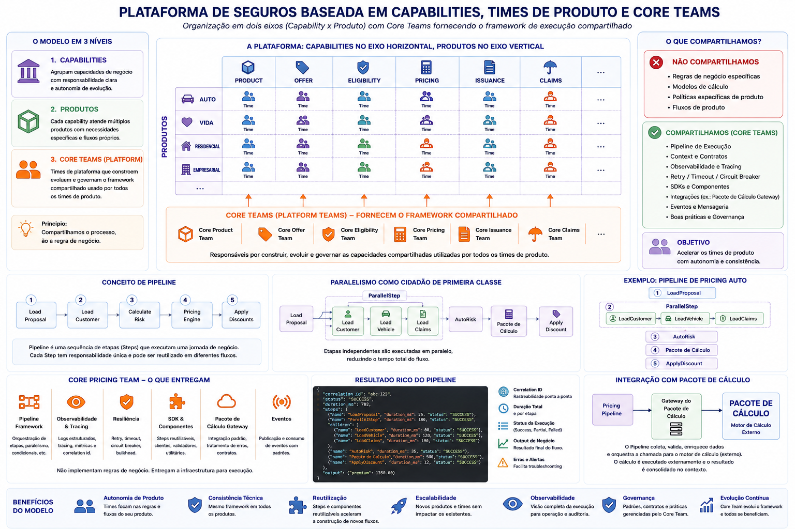

# Arquitetura de Plataformas de Seguros: Da Organização dos Times ao Pipeline de Execução

## Introdução

Quando falamos sobre modernização de plataformas de seguros, normalmente a discussão começa pela tecnologia:

- Microserviços
- Kubernetes
- APIs
- Event Driven
- Cloud

Entretanto, em projetos reais, a maior dificuldade raramente está na tecnologia.

O desafio está em encontrar uma arquitetura que consiga acompanhar a forma como o negócio e as equipes estão organizados.

Em uma seguradora, diferentes produtos possuem necessidades específicas:

- Auto
- Vida
- Residencial
- Empresarial

Ao mesmo tempo, existem capacidades de negócio compartilhadas:

- Produto
- Oferta
- Elegibilidade
- Pricing
- Emissão
- Sinistro

A pergunta passa a ser:

> Como construir uma plataforma capaz de suportar múltiplos produtos, múltiplas capacidades e múltiplas equipes sem criar um monólito distribuído?

---

# O Problema do Core Compartilhado

A primeira ideia normalmente é construir um grande **Insurance Core**.

```text
Insurance Core

├── Produto
├── Oferta
├── Pricing
├── Emissão
└── Sinistro
```

Inicialmente a solução parece elegante.

Porém, conforme novos produtos surgem, a complexidade aumenta.

Auto exige regras específicas.

Vida exige processos distintos.

Residencial possui fluxos próprios.

Com o tempo, o Core passa a concentrar centenas de condicionais e disputas entre equipes.

```python
if product == "AUTO":
    ...

elif product == "VIDA":
    ...

elif product == "RESIDENCIAL":
    ...
```

O resultado costuma ser um sistema difícil de evoluir e cada vez mais acoplado.

---

# Pensando em Capabilities

Uma abordagem mais sustentável é separar a plataforma por capacidades de negócio.

```text
Insurance Platform

├── Product Platform
├── Pricing Platform
├── Offer Platform
├── Issuance Platform
└── Claim Platform
```

Cada capability possui responsabilidade clara e autonomia de evolução.

Por exemplo:

### Pricing Platform

Responsável por:

- Tarifação
- Simulações
- Integrações com motores de pricing
- Auditoria de cálculo

### Offer Platform

Responsável por:

- Campanhas
- Promoções
- Segmentação
- Testes A/B

### Product Platform

Responsável por:

- Coberturas
- Planos
- Questionários
- Configurações de produto

---

# O Segundo Eixo: Produtos

Mesmo dentro de uma capability, os produtos continuam sendo diferentes.

```text
Pricing Auto ≠ Pricing Vida

Offer Auto ≠ Offer Vida

Product Auto ≠ Product Vida
```

Na prática, passamos a ter uma matriz organizacional.

```text
                    AUTO      VIDA      RESIDENCIAL

PRODUCT              X         X             X

PRICING              X         X             X

OFFER                X         X             X

ISSUANCE             X         X             X
```

Cada célula dessa matriz pode possuir equipes, backlog e roadmap próprios.

---

# O Que Compartilhar?

Um erro comum é compartilhar regras de negócio.

Por exemplo:

- AutoRisk
- LifeRisk
- CoverageRules
- PremiumCalculation

Essas regras inevitavelmente divergem com o tempo.

O compartilhamento mais valioso normalmente está na infraestrutura de execução.

Por exemplo:

- Pipeline
- Saga
- Context
- Retry
- Observabilidade
- Eventos

Em outras palavras:

> Compartilhamos o processo, não a regra.

---

# O Caso do Pricing

Considere uma capability de Pricing.

O objetivo é permitir que diferentes produtos construam seus fluxos de cálculo sem duplicar infraestrutura.

## Auto Pricing

- Vehicle Risk
- Claims History
- pacote de calculo
- Discounts

## Life Pricing

- Health Analysis
- Age Analysis
- pacote de calculo
- Capital Validation

Os fluxos são diferentes, mas a mecânica de execução é a mesma.

---

# Introduzindo o Pipeline

Um Pipeline é uma sequência de etapas responsáveis por executar uma jornada de negócio.

Exemplo:

```text
Load Proposal
      ↓

Load Customer
      ↓

Calculate Risk
      ↓

Pricing Engine
      ↓

Apply Discounts
```

Cada etapa possui responsabilidade única.

O Pipeline é responsável apenas pela orquestração.

---

# Modelando um Pipeline

A ideia central é simples.

```text
Pipeline

├── Context
├── Step
├── Result
└── Observability
```

## Context

Transporta informações ao longo da execução.

```python
@dataclass
class PipelineContext:

    correlation_id: str

    product: str

    data: dict

    result: dict
```

---

## Step

Representa uma unidade de trabalho.

```python
class Step(ABC):

    @abstractmethod
    async def execute(self, ctx):
        pass
```

---

## Pipeline

Coordena a execução dos Steps.

```python
pipeline = Pipeline(

  LoadProposalStep(),

  AutoRiskStep(),

  pacote de calculoPricingStep(),

  ApplyDiscountStep()
)
```

---

# Paralelismo Como Cidadão de Primeira Classe

Em seguros, diversas consultas podem ser realizadas simultaneamente.

Por exemplo:

- Cliente
- Veículo
- Histórico de Sinistros

Essas operações são independentes.

Executá-las sequencialmente gera desperdício de tempo.

Uma abordagem melhor consiste em executar essas tarefas em paralelo.

```text
                    LoadProposal
                          │
                          ▼

          ┌───────────────┼───────────────┐
          │               │               │

          ▼               ▼               ▼

     Customer        Vehicle        Claims

          └───────────────┼───────────────┘
                          │
                          ▼

                    AutoRisk

                          │
                          ▼

                        pacote de calculo
```

---

## Definindo um ParallelStep

```python
pipeline = Pipeline(

    LoadProposalStep(),

    ParallelStep(

        LoadCustomerStep(),

        LoadVehicleStep(),

        LoadClaimsStep()
    ),

    AutoRiskStep(),

    pacote de calculoPricingStep(),

    ApplyDiscountStep()
)
```

Com isso, o fluxo de negócio continua simples e declarativo.

---

# Resultados Ricos

Em ambientes corporativos, o resultado do Pipeline não deve conter apenas o valor final.

Também precisamos responder perguntas como:

- Quanto tempo cada etapa levou?
- Qual etapa falhou?
- Qual integração apresentou lentidão?
- Quais dados foram utilizados?

Por isso, o Pipeline produz um resultado rico contendo:

- Correlation Id
- Status
- Duração total
- Histórico de execução
- Resultado de negócio

---

## Exemplo de PipelineResult

```python
@dataclass
class PipelineResult:

    correlation_id: str

    status: str

    duration_ms: int

    steps: list

    output: dict

    errors: list[str]
```

---

## Exemplo de Retorno

```json
{
  "correlation_id": "abc-123",

  "status": "SUCCESS",

  "duration_ms": 782,

  "steps": [

    {
      "name": "LoadProposal",
      "duration_ms": 25
    },

    {
      "name": "ParallelStep",
      "duration_ms": 180
    },

    {
      "name": "AutoRisk",
      "duration_ms": 35
    },

    {
      "name": "pacote de calculoPricing",
      "duration_ms": 500
    }
  ],

  "output": {
    "premium": 1350.00
  }
}
```

---

# Exemplo Completo de Pricing Auto

Visualmente, o fluxo fica:

```text
LoadProposal
      │
      ▼

Parallel
├── LoadCustomer
├── LoadVehicle
└── LoadClaims

      │
      ▼

AutoRisk

      │
      ▼

pacote de calculoPricing

      │
      ▼

ApplyDiscount
```

E a definição do pipeline continua extremamente simples:

```python
pipeline = Pipeline(

  LoadProposalStep(),

  ParallelStep(

    LoadCustomerStep(),

    LoadVehicleStep(),

    LoadClaimsStep()
  ),

  AutoRiskStep(),

  pacote de calculoPricingStep(),

  ApplyDiscountStep()
)
```

Observe que toda a complexidade de:

- Retry
- Timeout
- Observabilidade
- Auditoria
- Tracing
- Paralelismo

permanece encapsulada dentro do framework.

---

# O Papel da pacote de calculo

Nesse modelo, o Pricing Platform não necessariamente calcula o prêmio.

Muitas seguradoras utilizam motores especializados como a pacote de calculo.

O papel do Pipeline passa a ser:

- Coletar informações
- Executar validações
- Enriquecer dados
- Orquestrar integrações
- Consolidar resultados

O cálculo efetivo pode ser realizado por uma ferramenta externa.

```text
Pricing Pipeline
        │
        ▼

  pacote de calculo Gateway
        │
        ▼

      pacote de calculo
```

Essa abordagem reduz o acoplamento entre a capability de Pricing e a tecnologia de tarifação utilizada.

---

# Conclusão

Arquiteturas de seguros costumam falhar quando tentam compartilhar regras de negócio entre produtos distintos.

Uma alternativa mais sustentável consiste em organizar a plataforma em dois eixos:

- Capabilities
- Produtos

Dentro de cada capability, o compartilhamento ocorre através de um framework de execução composto por conceitos como:

- Pipeline
- Context
- Steps
- Saga
- Observabilidade

Nesse modelo:

✅ Produtos evoluem de forma independente.

✅ Equipes possuem autonomia.

✅ Integrações permanecem padronizadas.

✅ Novos produtos podem ser adicionados sem impactar os existentes.

✅ O framework permanece estável ao longo do tempo.

O verdadeiro Core deixa de ser um conjunto de regras de negócio e passa a ser um mecanismo de execução capaz de suportar qualquer jornada da seguradora.


